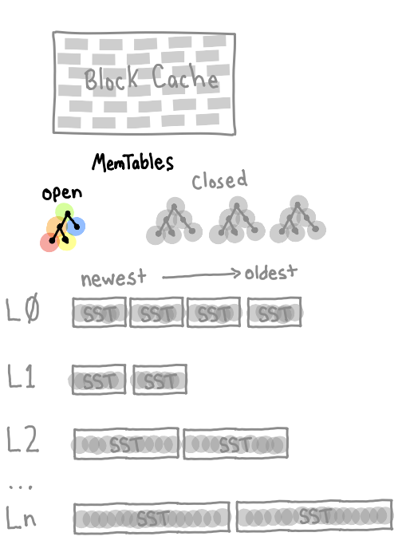

theme: TargetFira - understanding-rocksdb, 1
slidenumbers: true


## Understanding RocksDB

### Ted Naleid (he/him)

---

## Intended Audience

#### Those who haven't used RocksDB before

#### or those that have used its API<br/>but want to understand what's underneath

---

## Goals

#### Understanding when RocksDB might be a good fit for a problem

#### Learn RocksDB interface & some application interaction patterns

#### Peek at RocksDB Internals - Be able to reason about the system<br/>and tune it for performance

##### Let's turn magic into science

---

## What is RocksDB?

### An embeddable, disk-backed,<br/>persistent, key-value store<br/>for fast storage

---

## What is RocksDB?

#### Created by Facebook, Based on LevelDB from Google

#### Written in C++

#### Official Java wrapper

#### Other languages (Rust, Go, Python) have wrapper libraries

#### On the JVM it uses off-heap memory

---

## RocksDB is "embedded", what does that mean?

#### RocksDB runs in the same process as your application code

#### Each application instance will have its own RocksDB

---

### Embedded DB Advantages

#### Isolation - owned by a single application instance

#### No coordination - "Silence is Golden"[^1]

#### Local-access is very fast

#### Compare to redis/memcached - in-memory but far away

#### Total control - no other team needed to access or make changes

[^1]: [youtube: Peter Bailis - Silence is Golden: Coordination-Avoiding System Design](https://www.youtube.com/watch?v=EYJnWttrC9k) 

---

### Embedded DB Disadvantages

#### Total control - monitoring & tuning are your responsibility

#### Ephemeral - no persistent storage

#### Not distributed, not highly-available, no failover

#### More of a system building block

---

### Comparison to Other Systems You Might Have Experience With

#### Quickest comparisions are EHCache or SQLite3

#### Unlike EHCache, RocksDB is disk-backed<br/>and scales beyond instance memory

---

### Example Projects Relying on RocksDB 

#### Confluent Kafka Streams
#### MyRocks - alternative MySQL storage engine from Facebook
#### Flink - `RocksDBStateBackend`

---

### Similar Concepts In Many NoSQL Datastores

#### Cassandra/ScyllaDB  (`LeveledCompactionStrategy`)
#### InfluxDB - TSM (Time-Structured Merge Tree)
#### Kafka - immutable SSTable files, compacted topics
#### CockroachDB - Pebble (RocksDB inspired)
#### TiKV - Distributed key/value database

---

## Application Patterns


### Sharded Kafka/Stream Processor - Blackboard

#### Storage on ephemeral TAP instance (40GB max)

#### Save/restore checkpoint to S3

---

## Application Patterns 


### Resilient Read-Only APIs

#### Alternative to Hollow, Expands Beyond Memory

#### No Uptime Dependencies!

---

## Application Patterns


### Disk-Backed Off-Heap Cache 

#### Alternative to EHCache

---

## Application Anti-Patterns

#### RocksDB should not be the source of truth

#### Source of truth should be Postgres/Cassandra/Mongo/etc

--- 

## RocksDB API

### There are no types

### All keys and values are byte arrays

---

# Given A Few Kotlin Helper Functions

[.code-highlight: 3, 10-16]

```kotlin
@file:DependsOn("org.jetbrains.kotlin:kotlin-stdlib-jdk7:1.7.10")
@file:DependsOn("org.rocksdb:rocksdbjni:7.7.3")
import org.rocksdb.*

RocksDB.loadLibrary() // instantiates the rocksdb native library

val simpleRocksDbDir = "/tmp/simpleRocksDb"

// open a new rocksdb instance in a temp directory and give it to the block
// uses the "default" column family to store all values
fun <T> withSimpleRocksDb(dir: String = simpleRocksDbDir, block: (RocksDB) -> T): T =
    RocksDB.open(dir).use { rocksDb ->
        return block(rocksDb)
    }

// RocksDB only has ByteArray keys and values, add functions so we can use String for both
fun RocksDB.put(key: String, value: String) = put(key.toByteArray(), value.toByteArray())
fun RocksDB.get(key: String): String? = get(key.toByteArray())?.let { String(it) }
```

---

# Point Upsert/Lookup - Single Key/Value


[.code-highlight: 2-4, 7]

```kotlin
withSimpleRocksDb { rocksDb ->
    rocksDb.put("current_year", "2024")

    println(rocksDb.get("current_year"))
}

2024
```

<br/>
<br/>
<br/>
<br/>

---

# Batch Write - Many Key/Values

[.code-highlight: 1, 6-12, 15, 18]

```kotlin
// write 100M key/value pairs in 1M tuple batches
withSimpleRocksDb { rocksDb ->
    val writeOptions = WriteOptions()
    val defaultColumnFamily = rocksDb.defaultColumnFamily
    WriteBatch().use { batch ->
        (1..100_000_000).forEach { ordinal ->
            batch.put(defaultColumnFamily, "key_${ordinal}".toByteArray(), """{ "value": ${ordinal} }""".toByteArray())
            if (ordinal % 1_000_000 == 0) {
                rocksDb.write(writeOptions, batch)
                batch.clear()
            }
        }    
    }
    
    println(rocksDb.get("key_9000"))
}

{ "value": 9000 }
```

---

# Range Lookup - Key/Value Iterator

[.code-highlight: 1, 4-11, 14-18]

```kotlin
// seek to key_9000 and print the next 5 values
withSimpleRocksDb { rocksDb ->
    var count = 0
    rocksDb.newIterator(rocksDb.defaultColumnFamily).use { rocksIterator ->
        rocksIterator.seek("key_9000".toByteArray())
        
        while(rocksIterator.isValid && count++ < 5) {
            println("${count}: ${String(rocksIterator.key())} -> ${String(rocksIterator.value())}")
            rocksIterator.next()
        }    
    }
}

1: key_9000 -> { "value": 9000 }
2: key_90000 -> { "value": 90000 }
3: key_900000 -> { "value": 900000 }
4: key_9000000 -> { "value": 9000000 }
5: key_90000000 -> { "value": 90000000 }
```
#### Key sort order is important to understand when iterating

---

## Other API Features

#### Snapshots - quick & atomic - can be `tgz`ed up -> S3

#### Column Families - similar to a table, individually tuned

#### Transactions - persist all key/values or none

#### Time To Live (TTL) - expire keys at the column family level


---

## RocksDB Internal Architecture

---

## Most Relational Databases Use B-Trees


### Optimized for Reading

### Writing is Random I/O & Can Update Many Pages on Disk [^2]

[^2]: [image source: wikipedia B-tree](https://en.wikipedia.org/wiki/B-tree) 

---

## RocksDB uses an LSM Tree

#### LSM Tree = Log Structured Merge Tree

---


## High Level Architecture

### Write-Ahead Log (WAL)

### MemTables

### SST files in LSM Tree

---

## SST Files - LSM Building Block[^3]


### SST = Sorted String Table 

### A sorted immutable map of<br/>keys and values

### Keys and values are<br/>arbitrary byte arrays

[^3]: image source: Designing Data Intensive Applications, P76

---

## SSTable - Block Size[^4]


#### SST files use block compression

#### `blockSize` default is `4KiB`<br/>commonly increased to `16-256KiB`

#### Smallest amount of data that will be returned on a read

#### The biggest lever for read/write/space tuning

#### Bigger blocks = better compression, smaller indexes, slower reads

[^4]: image source: Designing Data Intensive Applications, P77

---

## SSTable - Index [^4]


### Each SST file has a sparse in-memory index pointing at each block

### The index allows efficient seeking

[^4]: image source: Designing Data Intensive Applications, P77


---

### Bloom/Ribbon Filters[^8]


#### Embedded in SST files

#### Probabilistic data structures used to test if an element<br/>definitely does not exist or likely exists

#### Enable with `setFilterPolicy(BloomFilter(bloomBitsPerKey))`

#### `bloomBitsPerKey = 10` will have ~1% false positive rate

#### Only used for point lookups, iterators don't use filters

[^8]: image source: https://en.wikipedia.org/wiki/Bloom_filter

---

# Write Path

---

## Write-Ahead Log (WAL)


### Used to reconstruct state after crash

### Single WAL for all column families

### Every write flushed to disk before returning

#### Bypass on write with `WriteOptions().setDisableWAL(true)`

---

## MemTable


### `writeBufferSize` is `64MiB` by default<br/>commonly `16MiB - 256MiB`

### When the open MemTable fills up, it becomes immutable and is replaced by a new MemTable

### `maxWriteBufferNumber` Default `2`<br/>Commonly Increased

---

## MemTable


### `SkipList` (binary search) is the default[^7]

### Solid write and read/scan support

### Alternatives `HashSkipList`, `HashLinkLists`, `Vector`

[^7]: image source: https://en.wikipedia.org/wiki/Skip_list


---

## Level 0


### A background thread flushes closed MemTables to SST files

### Writes are very fast sequential I/O

### Each flushed MemTable becomes the newest segment SST file in level 0

### Level 0 SST files can have overlapping key ranges

---

## Level 0 -> Level 1


### SST files accumulate in level 0 and are compacted with level 1 SST files

#### `level0FileNumCompactionTrigger` default `4`
#### `level0SlowdownWritesTrigger` default `20`
#### `level0StopWritesTrigger` default `36`

---

## Level 1..N


### Default is the Next Level is 10x Larger 

#### `maxBytesForLevelMultiplier` Default is `10`

#### `maxBytesForLevelBase` Default is 256MiB - Commonly <= 1GiB

#### L1 -> ~256MiB, L2 -> ~2.5 GiB, L3 -> ~25 GiB, ...

#### Good target is 20-40 files across all levels

#### Compaction is handled by background threads

---

### Deletes Create Tombstones 

#### Tombstones: the key associated with a special "tombstone" value

#### They take up (slightly) more space till compaction happens

#### A `DeleteRange` operation can be more write/space efficient

---

# Read Path

---

## Block Cache


#### Block Cache is per column family

#### Holds uncompressed blocks from SST files

#### Can be a substantial performance boost for getting hot keys

#### Invalidated on write of the key

#### `setBlockCache(LRUCache(cacheSizeInBytes)`<br/>default has `8MiB`, often in gigabytes

--- 

## Open MemTable



### If Block Cache is a miss, we next check the open MemTable

---

## Closed MemTables


### Followed by all closed, immutable MemTables in order newest -> oldest

---

## Level 0


### Then all Level 0 files<br/>in order newest -> oldest

### Bloom filters speed this up

### Level 0 SST files have overlapping key ranges, can have duplicates

---

## Level 1-N


#### Within each level > 0 SST files will not overlap keys

#### Compaction/deduplication has been run

#### Determines SST file per level that could hold the key

#### For each SST File it checks the Bloom Filter

#### If key might be in SST file, retrieves/decompresses block and puts into block cache

--- 

## SST File Compression

#### Each level can have it's own compression settings

#### Default compression type is `SNAPPY`

#### Often not worth compression Level 0, can cause write stalls

#### Recommendation, use `ZSTD` for the bottom level (best compression, more CPU)<br/>and `LZ4` for everything else

```kotlin
setCompressionOptions(CompressionOptions().apply {
    setCompressionType(CompressionType.LZ4_COMPRESSION)
    setBottommostCompressionType(CompressionType.ZSTD_COMPRESSION)
})
```

---

### RocksDB Can Emit Statistics About the Size of Each Level

[.code-highlight: 1, 6-8, 17, 24-27]

```kotlin
// write 100M key/value pairs in 1M tuple batches twice, so each key has a duplicate value
withSimpleRocksDb { rocksDb ->
    val writeOptions = WriteOptions()
    val defaultColumnFamily = rocksDb.defaultColumnFamily
    WriteBatch().use { batch ->
        (1..2).forEach { _ ->
            (1..100_000_000).forEach { ordinal ->
                batch.put(defaultColumnFamily, "key_${ordinal}".toByteArray(), """{ "value": ${ordinal} }""".toByteArray())
                if (ordinal % 1_000_000 == 0) {
                    rocksDb.write(writeOptions, batch)
                    batch.clear()
                }
            }   
        } 
    }

    rocksDb.getProperty(rocksDb.getDefaultColumnFamily(), "rocksdb.stats")
}


** Compaction Stats [default] **
Level    Files   Size     Score Read(GB)  Rn(GB) Rnp1(GB) Write(GB) Wnew(GB) Moved(GB) W-Amp Rd(MB/s) Wr(MB/s) Comp(sec) Comp(cnt) Avg(sec) KeyIn KeyDrop Rblob(GB) Wblob(GB)
------------------------------------------------------------------------------------------------------------------------------------------------------------------------------
  L0     19/1  327.53 MB   4.5      0.0     0.0      0.0       1.7      1.7       0.0   1.0      0.0     15.0    113.43        99    1.146       0      0       0.0       0.0
  L1     12/1  742.03 MB   2.7      3.9     1.3      2.6       3.6      1.0       0.0   2.7     11.1     10.2    361.10        23   15.700    454M    40M       0.0       0.0
  L2     11/0  661.98 MB   0.3      0.6     0.3      0.3       0.3      0.0       0.0   1.0     13.8      6.9     47.03         5    9.407     85M    36M       0.0       0.0
 Sum     42/2    1.69 GB   0.0      4.5     1.7      2.9       5.6      2.7       0.0   3.3      8.9     11.0    521.56       127    4.107    539M    76M       0.0       0.0
 Int      0/0    0.00 KB   0.0      4.1     1.5      2.7       4.6      2.0       0.0   4.2      9.5     10.7    443.91        89    4.988    493M    76M       0.0       0.0
```

---

### Compaction is a background process,<br/> but can be explicitly requested

[.code-highlight: 2, 3, 9-12]

```
withSimpleRocksDb { rocksDb ->
    rocksDb.compactRange(rocksDb.getDefaultColumnFamily())
    rocksDb.getProperty(rocksDb.getDefaultColumnFamily(), "rocksdb.stats")
}


** Compaction Stats [default] **
Level    Files   Size     Score Read(GB)  Rn(GB) Rnp1(GB) Write(GB) Wnew(GB) Moved(GB) W-Amp Rd(MB/s) Wr(MB/s) Comp(sec) Comp(cnt) Avg(sec) KeyIn KeyDrop Rblob(GB) Wblob(GB)
------------------------------------------------------------------------------------------------------------------------------------------------------------------------------
  L0      0/0    0.00 KB   0.0      0.0     0.0      0.0       0.0      0.0       0.0   1.0      0.0     14.9      1.15         1    1.154       0      0       0.0       0.0
  L1      0/0    0.00 KB   0.0      1.1     0.3      0.7       0.8      0.1       0.0   2.4     11.9      8.9     91.37         1   91.368    123M    31M       0.0       0.0
  L2     11/0  661.98 MB   0.3      1.5     0.8      0.7       0.7      0.0       0.0   0.9     14.1      6.6    109.67         2   54.835    201M    91M       0.0       0.0
 Sum     11/0  661.98 MB   0.0      2.6     1.1      1.4       1.5      0.1       0.0  90.5     13.0      7.7    202.19         4   50.548    325M   123M       0.0       0.0
 Int      0/0    0.00 KB   0.0      2.6     1.1      1.4       1.5      0.1       0.0 161.0     13.1      7.7    201.04         3   67.013    325M   123M       0.0       0.0
```

---

### Flushing a `SkipList` MemTable Will Remove Redundant Keys

[.code-highlight: 1, 6, 7, 14, 15, 18, 22-24]
```kotlin
// write 10M key/value pairs OF THE SAME KEY in 1M tuple batches
withSimpleRocksDb { rocksDb ->
    val writeOptions = WriteOptions()
    val defaultColumnFamily = rocksDb.defaultColumnFamily
    WriteBatch().use { batch ->
        (1..10_000_000).forEach { ordinal ->
            batch.put(defaultColumnFamily, "the_key".toByteArray(), """{ "value": ${ordinal} }""".toByteArray())
            if (ordinal % 1_000_000 == 0) {
                rocksDb.write(writeOptions, batch)
                batch.clear()
            }
        }    
    }
    println(rocksDb.get("the_key"))
    rocksDb.getProperty(rocksDb.getDefaultColumnFamily(), "rocksdb.stats")
}

{ "value": 10000000 }
** Compaction Stats [default] **
Level    Files   Size     Score Read(GB)  Rn(GB) Rnp1(GB) Write(GB) Wnew(GB) Moved(GB) W-Amp Rd(MB/s) Wr(MB/s) Comp(sec) Comp(cnt) Avg(sec) KeyIn KeyDrop Rblob(GB) Wblob(GB)
------------------------------------------------------------------------------------------------------------------------------------------------------------------------------
  L0      3/0    3.03 KB   0.8      0.0     0.0      0.0       0.0      0.0       0.0   1.0      0.0      0.0      0.50         5    0.100       0      0       0.0       0.0
  L1      1/0    1.01 KB   0.0      0.0     0.0      0.0       0.0      0.0       0.0   0.3      0.8      0.2      0.01         1    0.006       5      4       0.0       0.0
 Sum      4/0    4.04 KB   0.0      0.0     0.0      0.0       0.0      0.0       0.0   1.2      0.0      0.0      0.51         6    0.084       5      4       0.0       0.0
 Int      0/0    0.00 KB   0.0      0.0     0.0      0.0       0.0      0.0       0.0   1.2      0.0      0.0      0.51         6    0.084       5      4       0.0       0.0
```

#### Notice the number of files

---

## If We Compact We Get Down to a Single Value

[.code-highlight: 1, 3, 4, 11-13]

```kotlin
// compact the default column family
withSimpleRocksDb { rocksDb ->
    rocksDb.compactRange(rocksDb.getDefaultColumnFamily())
    rocksDb.getProperty(rocksDb.getDefaultColumnFamily(), "rocksdb.stats")
}


** Compaction Stats [default] **
Level    Files   Size     Score Read(GB)  Rn(GB) Rnp1(GB) Write(GB) Wnew(GB) Moved(GB) W-Amp Rd(MB/s) Wr(MB/s) Comp(sec) Comp(cnt) Avg(sec) KeyIn KeyDrop Rblob(GB) Wblob(GB)
------------------------------------------------------------------------------------------------------------------------------------------------------------------------------
  L0      0/0    0.00 KB   0.0      0.0     0.0      0.0       0.0      0.0       0.0   1.0      0.0      0.0      0.12         1    0.123       0      0       0.0       0.0
  L1      1/0    1.01 KB   0.0      0.0     0.0      0.0       0.0      0.0       0.0   0.3      2.5      0.5      0.00         1    0.002       5      4       0.0       0.0
 Sum      1/0    1.01 KB   0.0      0.0     0.0      0.0       0.0      0.0       0.0   2.0      0.0      0.0      0.13         2    0.063       5      4       0.0       0.0
 Int      0/0    0.00 KB   0.0      0.0     0.0      0.0       0.0      0.0       0.0   2.0      0.0      0.0      0.13         2    0.063       5      4       0.0       0.0
```


---

### Read/Write/Space Amplification<br/>RUM Conjecture[^6]

#### Read Overhead, Update Overhead, Memory (or Space) Overhead

#### Read+Update - Trade space for cheap reads/writes
#### Update+Memory - Trade slow reads for fast writes and low space
#### Read+Memory - Trade slow writes for fast reads and low space

[^6]: PDF - https://stratos.seas.harvard.edu/files/stratos/files/rum.pdf

---

### RocksDB Uses Memory In 3 Ways
#### Block Cache - uncompressed block cache for read operations
#### MemTable - write buffers that each new value is written to
#### SST File - indexes and bloom filters 

#### By default all are independent & per column family

---

### Memory - Off-Heap Memory

#### Indexes and Bloom filters can be consolidated<br/>into memory allocated for Block Cache

#### `setBlockCache(LRUCache(1024 * 1024 * 1024)`

#### `cacheIndexAndFilterBlocks = true`<br/>`cacheIndexAndFilterBlocksWithHighPriority = true`<br/>`pinL0FilterAndIndexBlocksInCache = true`

---
# Memory Allocator

### Default `glibc` Memory Allocator 

### Replace with `jemalloc` Allocator For Better Memory Usage


```Dockerfile
# Add to your ubuntu-flavored Dockerfile
RUN apt-get update && apt-get install -y libjemalloc-dev
ENV LD_PRELOAD=/usr/lib/x86_64-linux-gnu/libjemalloc.so
```

#### More Info: <br/>blog.cloudflare.com/the-effect-of-switching-to-tcmalloc-on-rocksdb-memory-use/

--- 


#### `glibc` vs `jemalloc` memory allocators

---

### General Recommendations

#### Use small keys - significant processing time is spent merging and sorting records by key

#### Disable WAL (Write Ahead Log) if you don't need it

#### Don't compress level 0, use `zstd` compression at bottom level

#### Eliminate serialization/deserialization wherever possible

#### Watch statistics for write stalls


---

## Additional Resources

```
https://github.com/facebook/rocksdb/wiki/RocksDB-Tuning-Guide

https://docs.rs/rocksdb/latest/rocksdb/struct.Options.html

https://github.com/facebook/rocksdb/blob/main/include/rocksdb/options.h

https://github.com/facebook/rocksdb/blob/main/include/rocksdb/advanced_options.h
```

---

# Questions?

#### <br/><br/><br/><br/>slides: https://github.com/tednaleid/understanding-rocksdb